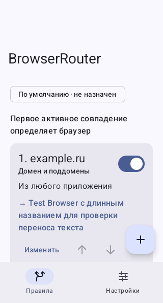
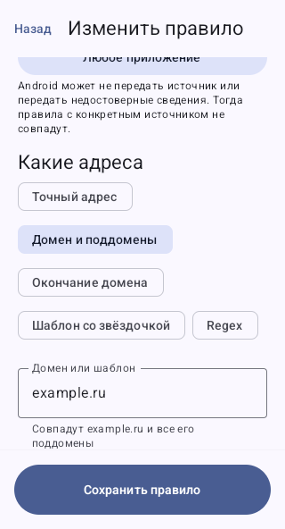
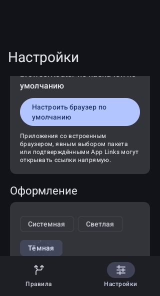

# BrowserRouter

**Разные ссылки — разные браузеры.** BrowserRouter принимает веб-ссылки из других приложений и открывает их в браузере по вашим правилам.

## Пример маршрутов

| Приоритет | Источник | Адрес / режим | Открыть в |
|---|---|---|---|
| 1 | Любой | `pikabu.ru`, домен и поддомены | Firefox |
| 2 | Любой | `*.com`, шаблон | Firefox |
| 3 | Любой | `.ru`, окончание домена | Bearium |
| 4 | Любой | `.local`, окончание домена | Chrome |
| Без совпадений | Любой | Остальные ссылки | Ваш fallback или выбор браузера |

Срабатывает **первое активное совпадение сверху вниз**. Поэтому конкретный сайт ставьте выше общего правила зоны. Это примеры: браузеры и маршруты выбираете вы. Поддерживаются все обнаруженные подходящие обработчики HTTP/HTTPS, без специального списка Firefox/Chrome/Bearium.

Можно ограничить правило приложением-источником, например Telegram, а также схемой, портом и началом пути. Если Android не определит источник, такое правило будет пропущено.

## Установка и первый запуск

1. Скачайте `BrowserRouter-<версия>.apk` из [GitHub Releases](https://github.com/ISAIandCO/BrowserRouter/releases). Разрешите установку APK для приложения, через которое скачали файл.
2. Откройте BrowserRouter и нажмите **«Назначить по умолчанию»**. Подтвердите системный выбор браузера. Можно также открыть настройки Android → приложения по умолчанию → браузер → BrowserRouter. Названия пунктов зависят от устройства.
3. Нажмите **+** («Создать правило»). Выберите источник либо любое приложение, режим адреса и целевой браузер. Проверьте показанный маршрут и сохраните.
4. В настройках выберите браузер для остальных ссылок. Если оставить «Выбирать при открытии», появится список доступных приложений.
5. Откройте ссылку из другого приложения через внешний браузер.

Обычные правила не требуют regex. «Домен и поддомены» включает сам домен; `*.example.ru` включает только поддомены. `.ru` не совпадает с `example.ru.evil.com`.

## Управление правилами

- Переключатель включает или выключает маршрут.
- Стрелки меняют приоритет. Они доступны для TalkBack и клавиатуры.
- «Изменить» открывает редактор; удаление требует подтверждения.
- Недоступный браузер не вызывает сбой: вы сможете выбрать другой.
- Импорт/экспорт находятся в настройках. Импорт может добавить правила в конец или заменить всё **после вашего выбора**.

## Маршрутизация по Geosite

В редакторе выберите **Geosite → «Выбрать группу»**, найдите сервис или категорию и назначьте браузер. Например, `geosite:youtube` → Firefox. Вместо выбора можно ввести название группы; атрибут `google@ads` ограничивает её рекламными доменами. Правило можно дополнительно ограничить источником, схемой, портом и путём.

Встроенная база [v2fly/domain-list-community](https://github.com/v2fly/domain-list-community) от 02.10.2026 содержит 1542 группы и работает без сети. Для своей или обновлённой базы: **Настройки → Geosite → «Импортировать geosite.dat»**. Поддерживается бинарный формат V2Ray, включая `dlc.dat`; до 16 МБ. Можно вернуться к встроенной базе. Выберите готовый источник **v2fly, Loyalsoldier или runetfreedom**, напрямую из GitHub или через CDN; свой HTTPS-адрес доступен отдельно. Нажмите «Сохранить и обновить сейчас» либо включите автообновление (по умолчанию каждые 24 часа). Можно ограничить загрузки сетью без тарификации. Android может откладывать фоновые запуски. При ошибке сохраняется предыдущая база.

Geosite — списки доменов, а не определение страны сервера. Если база недоступна или группа отсутствует, Router предложит выбрать браузер. JSON резервирует правила, а пользовательский `.dat` нужно сохранять отдельно. [Подробности](docs/geosite.md).

## Ограничения Android

BrowserRouter получает только ссылки, которые Android или приложение передаёт внешнему обработчику. Встроенные браузеры, Custom Tabs с явно выбранным пакетом, прямое открытие конкретного браузера и подтверждённые App Links могут обходить маршрутизатор. При необходимости отключите встроенный браузер в приложении-источнике и проверьте системное «Открывать поддерживаемые ссылки» у нужного приложения.

Источник определяется по доступным сведениям Intent. Android не гарантирует их наличие и достоверность; иногда виден посредник вместо исходного приложения. **Правила по источнику не являются защитой или контролем доступа.** Для надёжной маршрутизации по доменам используйте «Любое приложение».

Некоторые прошивки ограничивают выбор браузера по умолчанию. BrowserRouter запрашивает системную роль браузера; принять или отклонить запрос решает Android. Он не перехватывает ссылки внутри уже открытой веб-страницы.

Сеть используется только для загрузки geosite из выбранного источника; адреса открываемых страниц туда не передаются. Accessibility Service, Usage Access и доступ ко всему списку установленных пакетов не нужны. Не хранит историю URL и не использует аналитику. Настройки хранятся локально; их резервное копирование может выполнять системный механизм Android. BrowserRouter не обходит блокировки сайтов — подключение выполняет выбранный браузер.

## Скриншоты

Реальные снимки Android-эмулятора. Название Test Browser относится к тестовому обработчику: он не входит в пользовательский APK.

| Правила | Редактор | Тёмная тема |
|---|---|---|
|  |  |  |

[Светлая тема](docs/screenshots/settings-light-phone.png) · [Длинные названия при шрифте 160%](docs/screenshots/long-names-large-font.png) · [Широкий экран](docs/screenshots/rule-list-wide.png).

Снимки относятся к предыдущему прогону; последующие сборки выполняются без эмулятора. Результаты и границы проверок описаны в [docs/testing.md](docs/testing.md).

## Для разработчиков

[Архитектура, правила и формат JSON](docs/architecture.md) · [Android Intent и ограничения](docs/android-routing.md) · [UI и темы](docs/ui.md) · [Сборка и подпись релизов](docs/build-release.md) · [Проверки](docs/testing.md).

Проект распространяется по [GPL-3.0](LICENSE). Заимствованные инструменты и зависимости указаны в [NOTICE](NOTICE).
